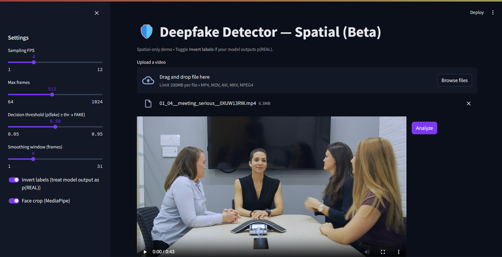
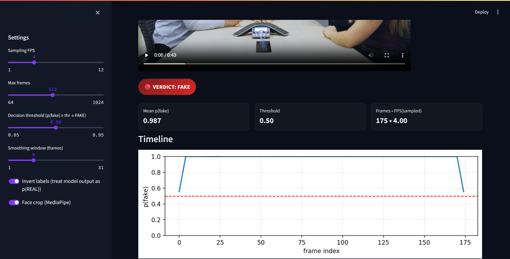
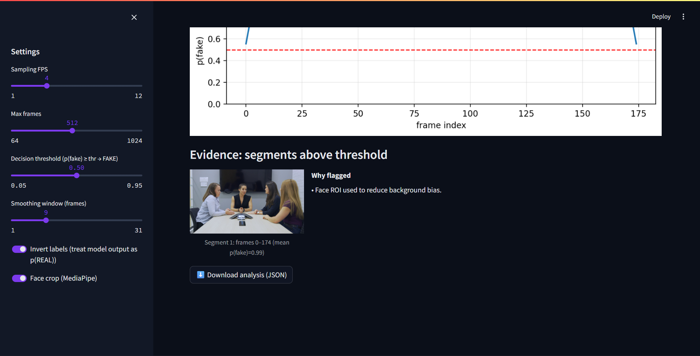
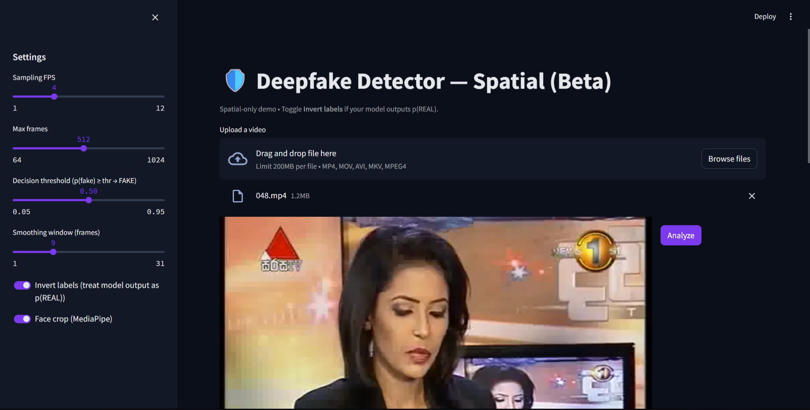
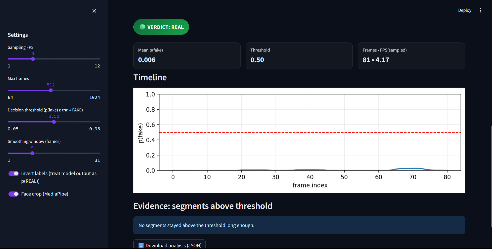

# 🎭 Deepfake Detection System  

## 🔹 Overview  
This project implements a **Deepfake Detection pipeline** using **YOLOv7, PyTorch, and Streamlit**.  
It detects manipulated faces in videos and images, providing a simple **web app interface** for demonstrations.  

✨ Features:  
- 🔍 Real-time deepfake detection on images/videos  
- 🖥️ Streamlit web UI for interactive demo  
- 📊 Model trained on **FakeAVCeleb** and **FaceForensics++ (C23)** datasets  
- 📈 Achieved ~92% classification accuracy in evaluation  

---

## 📂 Repository Structure  

<pre>deepfake-detection/ 
│── README.md 
│── requirements.txt 
│── main.py 
│── .gitignore 
│ 
├── configs/ # JSON configs (splits, calibration)
├── scripts/ # Training, evaluation, preprocessing, Streamlit app 
├── src/ # Core pipeline code 
├── results/ # Sample predictions & UI snapshots
├── .streamlit/ # Streamlit configuration 
└── data/ # (ignored) datasets/weights </pre>

---

## ⚙️ Installation & Setup  

### 1. Clone the repository  
```bash
git clone https://github.com/Wolfiee1911/Deepfake-Detector.git
cd Deepfake-Detector
```
### 2. Create a conda environment(recommended)
```bash
conda create -n deepfake python=3.10 -y
conda activate deepfake
```

### 3. Install Dependencies
```bash
pip install -r requirementes.txt
```

## ▶️ Usage

### 1. Run Detection via Streamlit
```bash
streamlit run scripts/web_app_streamlit.py
```

### 2. Train the Model
```bash
python scripts/train_spatial.py --config configs/train_split.json
```

### 3. Evaluate the Model
```bash
python scripts/eval_and_calibrate.py --config configs/val_split.json
```

## 📊 Results  

Snapshots of the Streamlit UI:  

|  |  |
|-----------------------------------|-----------------------------------|
|  |  |



- **Accuracy:** ~92% on FakeAVCeleb + FaceForensics++  
- **Latency:** ~25 FPS on RTX 4050

## 📦 Dataset

Due to size restrictions, datasets and pretrained weights are not included.

- FakeAVCeleb: Dataset Link

- FaceForensics++: Dataset Link

Download them and place inside data/ folder (see data/README.md).

## 🛠️ Tech Stack

- Python, PyTorch – Deep Learning

- YOLOv7 – Model backbone

- OpenCV – Pre/post processing

- Streamlit – Web UI

## 📌 Future Work

- Add audio-visual deepfake detection

- Deploy as a web service (Docker + Cloud)

- Expand dataset coverage

## 👨‍💻 Author  

**Svaraan Kumar Thammu**  

- 📧 [Email](mailto:svaraankumar.04@gmail.com)  
- 🔗 [LinkedIn](https://www.linkedin.com/in/svaraan-kumar)  
- 💻 [GitHub](https://github.com/Wolfiee1911)  
